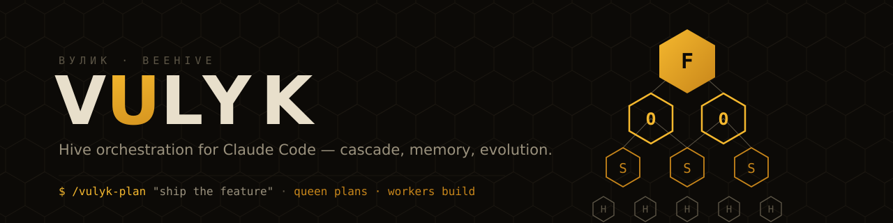
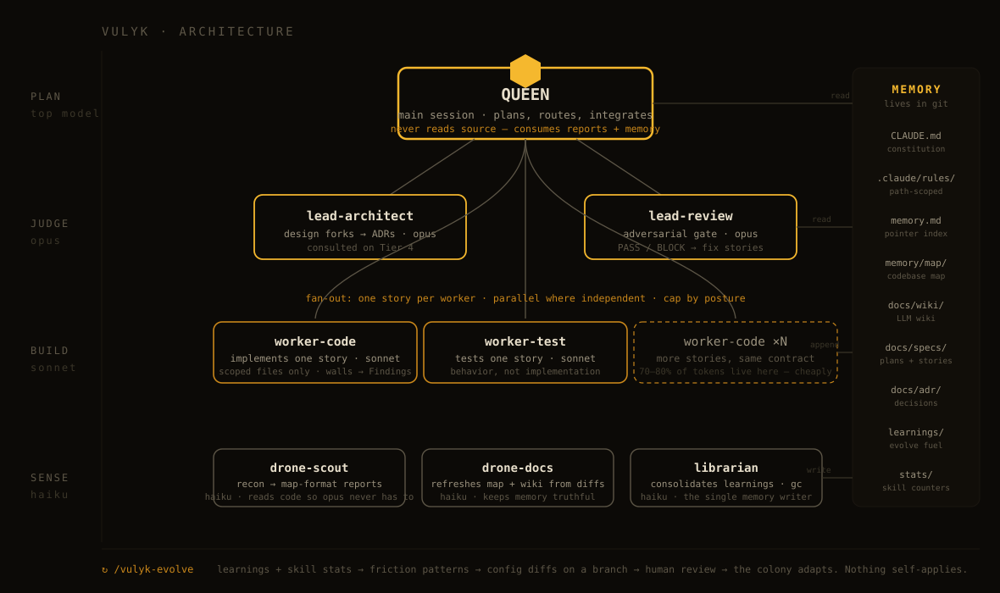

<p align="center">
  
</p>

<h1 align="center">VULYK</h1>

<p align="center"><strong>Hive orchestration for Claude Code.</strong><br/>
A model-cascade, memory-first, self-evolving framework for running multi-agent coding at scale — built entirely on native Claude Code primitives.</p>

<p align="center">
  <a href="https://github.com/Black-coffe/vulyk/actions/workflows/ci.yml"></a>
  <a href="LICENSE"></a>
  
  
  
</p>

---

**Vulyk** (Ukrainian: *вулик*) means **beehive**. A hive does not send the queen to gather pollen. It routes every job to the cheapest unit that can do it well, keeps shared memory outside any single bee, and continuously adapts the colony to the season. VULYK applies the same economics to AI-assisted software development:

- **Queen** — your main Claude Code session on the strongest model. Plans, decomposes, integrates. Never reads source code directly.
- **Leads** — Opus-class subagents for architecture decisions and adversarial review.
- **Workers** — Sonnet-class subagents that implement and test individual stories. This is where 70–80 % of tokens are spent — at roughly a fraction of top-model cost.
- **Drones** — Haiku-class subagents for reconnaissance, documentation updates, and memory upkeep.

The result: more parallel agents, larger codebases, dramatically less token burn on your 5-hour and weekly limits — with quality protected by an Opus "bookend" (plan and review on the strong model, execute on the efficient one).

<p align="center">
  
</p>

## Why VULYK exists

Three failure modes show up in every serious Claude Code setup:

1. **Token burn.** Running every task on the top model exhausts session and weekly limits long before the work is done. Routing is the single biggest cost lever in Claude Code — most setups never touch it.
2. **Large codebases make agents dumber.** Past ~100k LOC, stuffing context windows stops working. A 1M-token window is a trap, not a solution: quality degrades while costs explode. The fix is external memory — maps, wikis, and pointer indexes the agent consults instead of re-reading the world.
3. **Static configs rot.** Skills, rules, and agent prompts written in week one are stale by week six. Without a feedback loop, your setup never learns from its own mistakes.

VULYK answers all three with one coherent system: a **complexity-routing matrix** that picks the model tier *before* work starts, a **memory plane** (pointer index → codebase map → LLM wiki → learnings) that lives in git instead of in the context window, and an **evolution cycle** (`/vulyk-evolve`) that turns session learnings into reviewable pull requests against your own configuration — skills are born, updated, and retired with full git audit history.

### Built on native primitives only

VULYK uses **only** official Claude Code mechanisms: subagents, slash commands, skills, hooks, rules, and (optionally) Agent Teams. No SDK harness, no proxy, no third-party runtime. That means:

- ✅ Fully compatible with Pro / Max **subscription plans** under Anthropic's third-party tooling policy (effective April 4, 2026) — every API call is made by the official Claude Code client.
- ✅ Survives ecosystem policy changes — there is nothing here that can be cut off.
- ✅ Zero installation beyond copying files into your repo.

## How VULYK compares

| Approach | Model usage | Memory at scale | Learns over time | Runtime dependency |
|---|---|---|---|---|
| **Single top model, one session** | Everything on the strongest model — burns limits fastest | Context window only — degrades past ~100k LOC | No | None |
| **SDK / proxy orchestrators** | Programmable, but routing is your code to write | Whatever you build | Whatever you build | Custom runtime — breaks when the ecosystem shifts; often outside subscription policy |
| **Generic subagent prompts** | Mixed; tiering is ad-hoc and easy to drift | Usually none | No | None |
| **VULYK** | Routing-matrix cascade: queen/leads/workers/drones by tier, enforced in config | Git-based external memory plane (index → map → wiki → learnings) | Yes — `/vulyk-evolve` proposes config diffs as reviewable PRs | **None** — native Claude Code primitives only, subscription-safe |

**When VULYK is overkill:** a small repo (< ~20k LOC), a one-off script, or a throwaway prototype. The cascade earns its keep when token limits, codebase size, or config drift actually hurt — typically a real, growing codebase you return to week after week.

## Quickstart

**Option A — new project from template**

```bash
# Use this repository as a GitHub template (button above), then:
cd your-new-project
claude
> /vulyk-bootstrap
```

**Option B — add to an existing project**

```bash
git clone https://github.com/Black-coffe/vulyk /tmp/vulyk
/tmp/vulyk/install.sh /path/to/your/project
cd /path/to/your/project
claude
> /vulyk-bootstrap
```

`/vulyk-bootstrap` runs a short interview (stack, size, conventions, risk tolerance, token budget), then tailors the constitution, prunes the agent roster, builds an initial codebase map with Haiku drones, and seeds the wiki. **From that point on you work through three commands:**

```text
/vulyk-plan  "add OAuth login with refresh tokens"   # Queen plans, scouts recon, stories written
/vulyk-build                                          # Workers implement stories on Sonnet, in parallel
/vulyk-review                                         # Adversarial Opus review gate before merge
```

> **Tip:** enable Anthropic's experimental Agent Teams for collaborative Tier 3–4 work:
> `echo "CLAUDE_CODE_EXPERIMENTAL_AGENT_TEAMS=1" >> ~/.claude/.env`

## The model cascade

Every subagent declares its model in YAML frontmatter — the cascade is enforced by configuration, not willpower:

| Caste | Agent | Model | Job | Reads source? |
|---|---|---|---|---|
| 👑 Queen | *(main session)* + `queen-planner` | top model¹ / `opus` | Decompose goals, integrate results, own the roadmap | **Never** — consumes scout reports & memory only |
| 🛡 Lead | `lead-architect` | `opus` | Design decisions, ADRs, tradeoff analysis | Targeted excerpts only |
| 🛡 Lead | `lead-review` | `opus` | Adversarial review gate: correctness, security, invariants | Diffs + tests |
| 🐝 Worker | `worker-code` | `sonnet` | Implement exactly one story | Scoped slice via map |
| 🐝 Worker | `worker-test` | `sonnet` | Write/repair tests for one story | Scoped slice |
| 🔍 Drone | `drone-scout` | `haiku` | Recon: files, symbols, structure → map-format report | Yes — that's the point |
| 🔍 Drone | `drone-docs` | `haiku` | Update wiki & map notes after changes | Diffs |
| 🔍 Drone | `librarian` | `haiku` | Memory consolidation & garbage collection | Memory files only |

¹ The top model is whatever your plan currently makes economical. Set once in `CLAUDE.md` (`TOP_MODEL`). As of June 2026 that's `claude-fable-5` while it is included in subscription plans, falling back to `claude-opus-4-8` afterwards — one line to change, the rest of the hive is model-agnostic.

### The routing matrix

Routing happens **before** any work starts. The Queen classifies every request into a tier (the matrix lives in `CLAUDE.md`, so it is enforced on every prompt):

| Tier | Signal | Who works | Cost shape |
|---|---|---|---|
| 0 | Trivial, single file, obvious | Main session directly | minimal |
| 1 | One module, clear task | 1 × `worker-code` (+ scout) | cheap |
| 2 | Feature within a module | 2–4 workers, architect consulted | plan is expensive, body is cheap |
| 3 | Cross-cutting, multi-module | Full pipeline: plan → fan-out → review | bookend |
| 4 | Architecture / migration / 200k+ LOC touched | Tier 3 + adversarial review + max effort | deliberately expensive |

**Bookend rule:** spend top-model tokens at the two points where they change everything downstream — planning and final review. Everything in between runs on Sonnet and Haiku.

## Command reference

| Command | What it does |
|---|---|
| `/vulyk-bootstrap` | Interview → tailored constitution, pruned roster, initial map & wiki seed |
| `/vulyk-plan <goal>` | Queen mode: scouts recon, plan + story files written to `docs/specs/`, tier assigned, approval requested |
| `/vulyk-build [story]` | Execute approved stories with cascade-routed workers, parallel where independent |
| `/vulyk-review [scope]` | Adversarial `lead-review` pass; blocks on critical findings |
| `/vulyk-map [path]` | (Re)build the codebase map for a path using Haiku scout batches |
| `/vulyk-evolve` | Weekly self-evolution: mine learnings & usage stats → propose config diffs as a reviewable changeset |
| `/vulyk-gc` | Memory garbage collection: consolidate learnings, prune stale map entries, archive dead skills |
| `/vulyk-status` | Open stories, memory freshness, skill usage stats, budget posture |

Full details: [docs/command-reference.md](docs/command-reference.md)

## The memory plane

Nothing important lives only in a context window. VULYK keeps five layers in git:

```text
CLAUDE.md            constitution: laws, routing matrix, protocols   (< 150 lines, always loaded)
.claude/rules/       path-scoped rules, loaded only where relevant
memory/memory.md     pointer index (≤ 60 lines, always loaded) → links to everything below
memory/map/          one file per module: purpose, entry points, key types, gotchas, last-verified
docs/wiki/           LLM wiki: one note per domain/invariant, densely linked, Obsidian-compatible
memory/learnings/    raw session learnings (hook-captured) → fuel for /vulyk-evolve
```

Two protocols make this safe at scale: **memory is a hint, not truth** (agents verify pointers against real code before acting), and **only the librarian consolidates** (workers append, one drone merges — no concurrent-write races). Hooks snapshot state before every context compaction, so nothing is lost to `/compact`.

Deep dive: [docs/memory-system.md](docs/memory-system.md)

## Self-evolution

`/vulyk-evolve` closes the loop most setups leave open:

1. **Harvest** — `insight-harvester` reads `memory/learnings/*` and your `/insights` output; `skill-gardener` reads per-skill usage counters collected by a hook.
2. **Diagnose** — top friction patterns, unused skills (archive candidates), repeated manual patterns (new-skill candidates).
3. **Propose** — a changeset against `.claude/` itself: diffs to rules, agents, skills, plus a `CHANGELOG` entry justifying each change.
4. **Human gate** — nothing self-applies. You review the changeset like any PR.
5. **Retire** — archived skills move to `.claude/skills/_graveyard/` with date and reason. History is never lost.

Each cycle is a ratchet: the colony clicks forward and never slips back.

## Hooks

| Hook | Event | Effect |
|---|---|---|
| `session-start-brief.sh` | SessionStart | Injects memory freshness + pending-learnings line into context |
| `session-end-learnings.sh` | SessionEnd | Captures a structured learnings stub (optional Haiku auto-distill with `VULYK_AUTOLEARN=1`) |
| `skill-usage-counter.sh` | PostToolUse (Skill) | Increments per-skill counters → fuel for `skill-gardener` |
| `context-guard.sh` | PreCompact | Snapshots memory & task state before compaction |

A sample `scripts/git-hooks/post-merge` flags the map as stale after merges so `/vulyk-status` reminds you to re-map.

## FAQ

**Does this work on a Pro/Max subscription?** Yes — that is the design constraint. Everything runs inside the official Claude Code client. (Running many parallel sessions still consumes your limits faster; the cascade exists precisely to keep that affordable.)

**Do I need Agent Teams?** No. Default orchestration uses subagent fan-out from the main session. Agent Teams (experimental flag) adds peer-to-peer coordination for Tier 3–4 collaborative work.

**Can subagents spawn subagents?** No — a deliberate Claude Code constraint. VULYK's design respects it: all fan-out happens from the Queen (main session); leads and workers are single-purpose.

**My repo already has a CLAUDE.md.** `install.sh` never overwrites it — it writes `CLAUDE.vulyk.md` and prints a one-line `@import` to add.

**Is this affiliated with Anthropic?** No. VULYK is an independent open-source project. Claude and Claude Code are trademarks of Anthropic, PBC.

## Documentation

[Getting started](docs/getting-started.md) · [Architecture](docs/architecture.md) · [Model cascade](docs/model-cascade.md) · [Memory system](docs/memory-system.md) · [Self-evolution](docs/self-evolution.md) · [Command reference](docs/command-reference.md) · [Hooks reference](docs/hooks-reference.md) · [FAQ](docs/faq.md)

## Roadmap

- [ ] Deterministic pipelines on the Claude Code Workflows API once it stabilizes (example shape in `.claude/workflows/`)
- [ ] Plugin-marketplace packaging (`/plugin install vulyk`)
- [ ] Worktree fan-out preset for issue-driven parallelism
- [ ] Public eval harness: cascade vs. single-model baselines on open tasks

## Contributing

PRs welcome — see [CONTRIBUTING.md](CONTRIBUTING.md). The most valuable contributions right now: real-world routing-matrix tuning, memory-plane patterns from 200k+ LOC repos, and `/vulyk-evolve` heuristics.

## License

[MIT](LICENSE) © 2026 VULYK contributors

---

<p align="center">If the hive saves your weekly limit, <strong>star the repo</strong> — it helps other keepers find it. 🐝</p>
